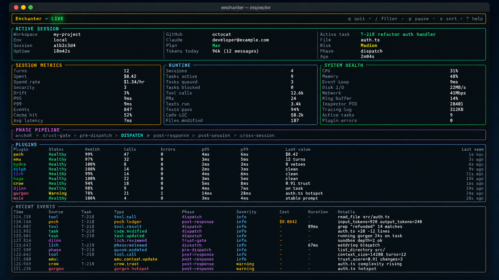

# Enchanter

[](https://github.com/enchanter-ai/enchanter/actions/workflows/ci.yml)
[](LICENSE)

<p align="center">
  <a href="inspector/">
    
  </a>
</p>

> Production-grade agent SDK with native Model Context Protocol support, hybrid orchestrator, and 10 capability plugins.

Enchanter is a TypeScript SDK for building agentic AI applications that speak [MCP (Model Context Protocol)](https://modelcontextprotocol.io). It wraps every outbound tool call in a 7-phase orchestrator lifecycle, runs it through an in-process event bus, and lets specialized plugins (trust scoring, drift detection, security veto, code review, structural fingerprinting, cost attribution, git workflow, and more) observe, modify, or block before the request leaves your process.

**v0.4.0 — full-stack agent SDK with shipped Rust observability surface.** 347 tests / 7 todo / 0 fail across 37 files. Observability is the Rust terminal cockpit at [`inspector/`](inspector/) — htop / btop / k9s for an AI agent runtime — consuming the runtime's JSONL event stream over stdin, file, or TCP socket. Each plugin adapter is independently installable as `@enchanter-ai/plugin-*` from `packages/`. Release pipeline (`scripts/publish-packages.ts` + `.github/workflows/publish.yml`) ships on `v*.*.*` tags.

## Install

```bash
npm install enchanter
```

Requires Node 22+.

## Quickstart

```typescript
import {
  McpClient,
  StdioTransport,
  hydraAdapter,    // security veto + secret masking
  pechAdapter,     // cost ledger + budget thresholds
  setBudget,
} from 'enchanter';
import { spawn } from 'node:child_process';

// Spawn any MCP-spec server (filesystem, github, postgres, ...)
const server = spawn('npx', ['-y', '@modelcontextprotocol/server-filesystem', '/path/to/sandbox']);
const transport = new StdioTransport(server.stdout!, server.stdin!);

setBudget('fs', 100_000);

const client = new McpClient({
  serverId: 'fs',
  transport,
  plugins: [hydraAdapter, pechAdapter /* + 8 more */],
});

await client.initialize('my-app', '1.0.0');
const tools = await client.listTools();
const result = await client.callTool('read_file', { path: 'config.txt' });
// hydra masks AWS keys / bearer tokens / PEM blocks in the response
// pech appends a ledger entry per call
```

## What's in the box (v0.3.2)

| Subsystem | Status |
|---|---|
| 7-phase request orchestrator (anchor → trust-gate → pre-dispatch → dispatch → post-response → post-session → cross-session) | ✓ |
| In-process pub/sub bus with bounded ring buffer + correlation_id propagation | ✓ |
| stdio transport (newline-delimited UTF-8 JSON-RPC 2.0, 8MB body cap) | ✓ |
| Streamable HTTP transport (POST + GET, exp-backoff reconnect, resume disabled by default) | ✓ |
| OAuth 2.1 + S256 PKCE + RFC 8707 audience binding + SSRF guard | ✓ |
| **OAuth replay defense** — nonce + freshness store, in-memory + JSONL-persistent | ✓ v0.3 |
| **TLS cert pinning** — TOFU + PINNED policies, hooked into the streaming HTTP transport | ✓ v0.3.1 |
| **Full trust-pin** — SHA-256 over (cmd + args + url + schemaDigests), enforced in trust-gate | ✓ v0.3.2 |
| Namespace registry with SHA-256 schema-digest pin (MCPoison defense) | ✓ |
| Tool name collision rejection | ✓ |
| **JSONL event bridge** — runtime → inspector wire contract with stdout / file / TCP sinks | ✓ v0.3 |
| **Rust terminal cockpit** ([`inspector/`](inspector/)) — 10 live views over the JSONL stream | ✓ v0.3 |
| 10 plugin adapters (now all on v0.3 algorithms — pech file-backed ledger, lich M5 sandbox + tool-call confirm, djinn D2 HMM, gorgon Tarjan + Python AST) | ✓ v0.3.x |
| Independently installable `@enchanter-ai/plugin-*` packages (workspace) | ✓ v0.3.2 |
| Live integration tested against `@modelcontextprotocol/server-filesystem` | ✓ |
| 9 of 10 documented MCP failure modes mitigated | ✓ |

## The 10 plugins

Each plugin is its own repo under [github.com/enchanter-ai](https://github.com/enchanter-ai/). The TypeScript adapters in this SDK (`src/plugins/*.adapter.ts`) port the algorithms; the source repos hold the original Python implementations + Claude Code skills.

| Plugin | Lifecycle phase | Role | Source |
|---|---|---|---|
| **crow** | trust-gate | Bayesian trust scoring + info-gain review ordering | [enchanter-ai/crow](https://github.com/enchanter-ai/crow) |
| **djinn** | anchor + post-session | Intent anchoring + drift detection across `/compact` | [enchanter-ai/djinn](https://github.com/enchanter-ai/djinn) |
| **emu** | pre-dispatch + post-response | Token economy monitor + ±CI runway forecast | [enchanter-ai/emu](https://github.com/enchanter-ai/emu) |
| **gorgon** | cross-session + post-response | Codebase structural intelligence (PageRank hotspots) | [enchanter-ai/gorgon](https://github.com/enchanter-ai/gorgon) |
| **hydra** | trust-gate + post-response | Real-time security interception (1844 CVE-mapped patterns) | [enchanter-ai/hydra](https://github.com/enchanter-ai/hydra) |
| **lich** | post-response | Code review with sandboxed confirmation + Bayesian preference | [enchanter-ai/lich](https://github.com/enchanter-ai/lich) |
| **naga** | trust-gate + post-response + post-session | Structural replication (AST + TF-IDF + naming convention) | [enchanter-ai/naga](https://github.com/enchanter-ai/naga) |
| **pech** | post-response | Cost attribution ledger + budget thresholds | [enchanter-ai/pech](https://github.com/enchanter-ai/pech) |
| **schematic** | governance (non-runtime) | Canonical scaffold template | [enchanter-ai/schematic](https://github.com/enchanter-ai/schematic) |
| **sylph** | trust-gate + post-session | Git workflow automation + destructive-op gate | [enchanter-ai/sylph](https://github.com/enchanter-ai/sylph) |

The companion prompt-engineering meta-engine [Wixie](https://github.com/enchanter-ai/wixie) runs the research → craft → converge → harden → translate lifecycle that produced the original architecture spec.

## Live demo

```bash
git clone https://github.com/enchanter-ai/enchanter.git
cd enchanter
npm install
npx tsx scripts/demo-live.ts
```

Spawns the official `@modelcontextprotocol/server-filesystem`, runs through all 7 phases, and shows hydra masking real AWS-key-shaped strings + bearer tokens in file content, and vetoing synthetic `rm -rf /` and `cat ~/.ssh/id_rsa` calls on the bus.

Observability is the Rust terminal cockpit at [`inspector/`](inspector/) — single binary, reads the runtime's JSONL event stream from stdin / file / socket, renders 10 live views (overview, plugins, events, security, cost, drift, codebase, replay, runtime totals, active tasks). The earlier TS CLI inspector and VS Code extension were retired at v0.3 in favor of the terminal-first approach. The browser dashboard was intentionally dropped at v0.2.1 — see `IMPLEMENTATION_SUMMARY.md`.

## Streaming events to the inspector

The runtime supervisor (`scripts/run.ts`) ships every bus event as JSONL when `ENCHANTER_BRIDGE` is set. Default is off — unset env var preserves the existing WebSocket-broadcaster path. Three forms are accepted:

```bash
ENCHANTER_BRIDGE=stdout npx tsx scripts/run.ts -- npm test | enchanter           # pipe directly into the Rust TUI
ENCHANTER_BRIDGE=tcp://127.0.0.1:7878 npx tsx scripts/run.ts -- npm test         # for an inspector listening on a socket
ENCHANTER_BRIDGE=file:./run-2026-05-05.jsonl npx tsx scripts/run.ts -- npm test  # capture-to-replay
```

When `stdout` is selected, the supervisor re-routes the wrapped child's stdout to stderr so the JSONL wire stays uncorrupted.

## Architecture

A thin per-request orchestrator owns the canonical request lifecycle. An in-process bus carries plugin findings as derived events. Required plugins (hydra, lich, naga, pech, sylph) fail-closed on missing ACK; advisory plugins (crow, djinn, emu, gorgon) fail-open with `degraded=true`. MCP spec primitives (Resources, Prompts, Tools, Sampling, Roots, Elicitation) are honored verbatim with OAuth 2.1 + PKCE + RFC 8707 audience binding for remote servers.

Full architectural spec: produced by [Wixie](https://github.com/enchanter-ai/wixie) — see `output-opus-4-7.json` in that repo's prompts directory. ADRs for the three load-bearing decisions (hybrid coordination, security model, budget tiers) are at `adr/`.

See [IMPLEMENTATION_SUMMARY.md](IMPLEMENTATION_SUMMARY.md) for the per-file inventory + v0.3 follow-up plan.

## What shipped in v0.3

The original v0.3 roadmap is fully landed. Sub-iterations:

- **v0.3.0** — OAuth replay defense (nonce + freshness store, persistent JSONL), runtime → inspector JSONL bridge with explicit wire schema, file-backed pech ledger.
- **v0.3.1** — TLS cert pinning (FM 6), full trust-pin store (FM 10), lich M5 sandboxed code review, djinn D2 HMM drift detection (3-state ON_TASK / SIDEQUEST / LOST), gorgon Tarjan SCC + Python AST extractor.
- **v0.3.2** — `@enchanter-ai/plugin-*` workspace packages, orchestrator → trust-pin enforcement, `ENCHANTER_BRIDGE` env-switch supervisor wire-up, lich M5 tool-call confirmation variant.

Test count: 144 → 270 / 7 todo / 0 fail across 31 files. All v0.3 features are default-off behind config flags for back-compat — existing v0.2 callers see unchanged behavior.

## What shipped in v0.4

All five carry-overs from v0.3 landed:

- **#1 Lich M5 real-MCP-server replay** — `runSandboxedToolCallLive` re-issues captured `tools/call` against an injectable `transportFactory`, structurally diffs against the original response. Per-`(schemaDigest, argsDigest)` LRU cache (default 256) avoids doubling latency on repeats.
- **#2 Trust-pin digest expansion** — `TransportDescriptor` threads `cmd / args / binaryDigest / envAllowlist / url / schemaDigests` through `McpClient`. All 6 `TrustPinInputs` fields now contribute to the digest. `binaryDigest` is best-effort (cap 64 MiB, cached, fail-open on read failure).
- **#3 Djinn D2 HMM persistence** — `PersistentHmmStore` (JSONL, replay-on-construct, corrupt-tail tolerant) keyed by sessionId. `hmm_store_path` config opts in.
- **#4 Gorgon dotted-module resolution** — hand-rolled TOML parser extracts package roots from `[project]` / `[tool.poetry]` / `[tool.setuptools]` / `[tool.setuptools.packages.find]`. Roots merge additively; resolution walks `<root>/foo/bar.py` then `<root>/foo/bar/__init__.py`.
- **#5 Plugin-package release pipeline** — `release:prep` bumps root + 10 packages in lockstep. `publish-packages.ts --dry-run` validates shape; `--publish` runs `npm publish --access public` per package, gated on `NPM_TOKEN`. CI on `v*.*.*` tags. See [`docs/RELEASE.md`](docs/RELEASE.md).

## v0.5 roadmap

Forward-looking work after v0.4:

1. **Worker-side real-replay execution** — currently the live-replay path runs in the parent process via injected `transportFactory`. Move it inside the forked sandbox worker for true isolation.
2. **HMM state-shape versioning** — add a `version` field to `HmmStateSnapshot` so future state-space changes (more states, renamed states, different observation buckets) trigger a hard reset rather than silently mis-interpret.
3. **Actual `npm publish` of v0.4.0** — release pipeline is ready; awaits `NPM_TOKEN` setup + first tag.
4. **Inspector → bridge bidirectional control** — currently the bridge is one-way (runtime → inspector). Add an "approve" / "veto" channel from the inspector back into the orchestrator's trust-gate phase.

## Contributing

See [CONTRIBUTING.md](CONTRIBUTING.md) for development setup, plugin-authoring conventions, and the behavioral modules every plugin honors.

## License

[Apache 2.0](LICENSE).
